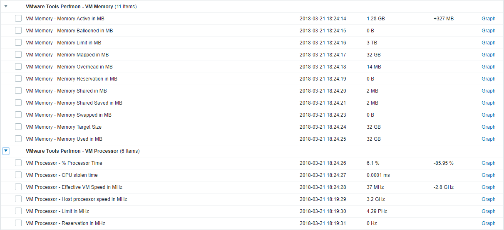

# Zabbix 3.4 - VMware Tools Windows performance counters Template

## Introduction

This is my approach for a performance monitoring Template of VMware Tools for Windows. 

This Template was created on and for Zabbix 3.4 and VMware Tools 9+ on Windows Server 2008 R2 / 2012 R2 / 2016.

## Installation

1. Zabbix Agent should be installed, configured and working.
1. VMware Tools should be installed and working.
1. Import the Template.
1. Link the Template to your desired Windows Host(s).

## Notes

- 19 Items, 1 disabled which I never needed (VM Processor - Shares)
- Every Item has the Description field populated with the official description of the perfmon values. 
- No Trigger, Graphs, Screens or LLD Discovery rules defined.
- I did my very best at defining the Preprocessing steps for each item value like MB, Hz and Percent. I hope I got them all right.

## Example

