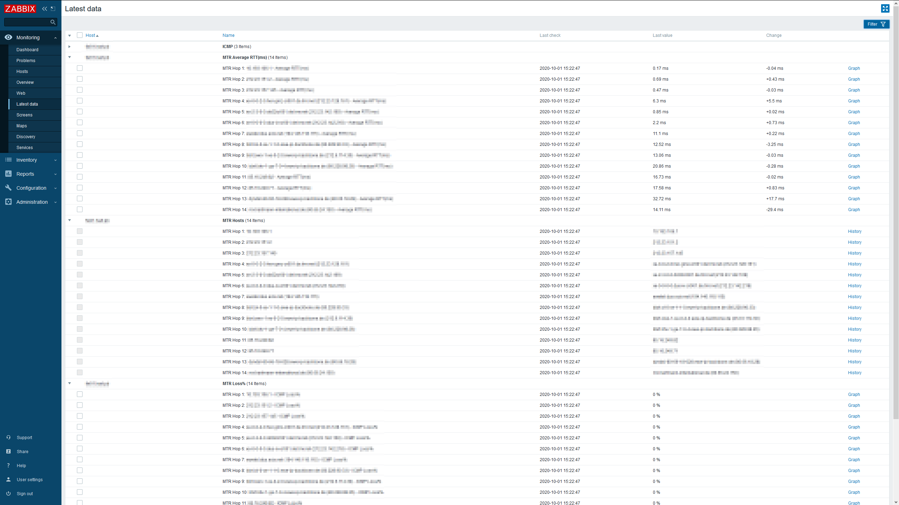

# Zabbix Network Monitoring with mtr (My traceroute)

## Introduction

A Zabbix template for mtr (My traceroute). It uses all the new features from Zabbix 4.4 and 5.0 with Master Items, JSONpath processing and Dependent items.
This template was built on Zabbix 5.0.x and Debian 9 & 10 amd64 with [mtr-tiny](https://packages.debian.org/stable/mtr-tiny).

## Installation

1. Copy the script file [mtr.sh](https://github.com/xenadmin/zabbix-templates/tree/master/zabbix-net-mtr/mtr.sh) to the **ExternalScripts** folder on your Zabbix Server or Proxy.
1. Make the script executable: `chmod +x mtr.sh`
1. Import the [Template](https://github.com/xenadmin/zabbix-templates/tree/master/zabbix-net-mtr/Template_Net_MTR.xml) to your Zabbix Server.
1. Link the template to the target host. From there on Zabbix Server or Proxy will discover and monitor the hops between itself and the target's HOST IP using the {HOST.IP} macro.

## Notes

These files and templates were tested and created on Zabbix 4.4 & 5.0 and Debian Linux 9 & 10 amd64 with the package [mtr-tiny](https://packages.debian.org/stable/mtr-tiny).
The XML file provided is exported from Zabbix 5.0.3.

This template creates a Master item, which executes the script and receives the JSON output. From there on we have a Low-Level-Discovery rule, that discovery three item prototypes:

- Name of each Hop
- Average RTT(ms) of each Hop
- ICMP Loss% of each Hop

There are no Trigger or Graph prototypes in this template at the moment.

Parts of this Template are directly related to [a reddit discussion](https://www.reddit.com/r/zabbix/comments/gvzvj7/monitoring_mtr_hops/), which gave me a very good starting point.

## Example / Screenshot

## Changelog

- 01 October 2020: initial commit.
